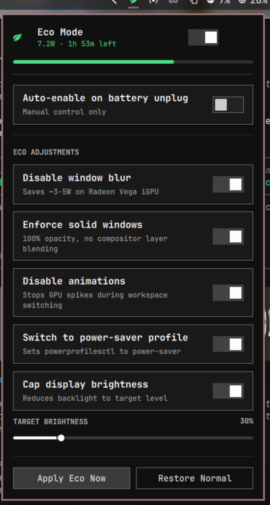

# lutfi.eco — Omarchy Eco Mode Manager

A native [Omarchy](https://omarchy.org/) Quickshell bar widget plugin that drastically reduces battery drain on laptops by toggling GPU visual effects, display brightness, animations, and CPU power profiles — all from a single click in the status bar.

Built specifically for AMD Ryzen + Radeon Vega integrated graphics laptops where Hyprland's multi-pass blur and window transparency are the primary battery culprits.

<div align="center">



*Drop-down configuration panel with real-time battery telemetry, master toggle, auto-switch, and granular adjustments.*

</div>

---

## Status Bar Indicator

The plugin lives in the right section of the Omarchy top bar. The leaf icon (🌿) provides immediate visual feedback:

| State | Indicator | Power Draw |
|---|---|---|
| **Eco OFF** (Normal / Aesthetic) | Foreground colored icon | ~11–16W (with 3-pass blur) |
| **Eco ON** (Battery Saver) | Bright green icon | ~5–7W |

---

## What it does

When **Eco Mode** is enabled, the plugin applies any combination of:

| Adjustment | Power Saving | Notes |
|---|---|---|
| **Disable Hyprland blur** | ~3–5W | Biggest gain on iGPU (Radeon Vega, Intel Xe) |
| **Enforce solid windows** (100% opacity) | ~1–2W | Eliminates compositor layer blending |
| **Disable Hyprland animations** | ~0.5–1W | Stops GPU spikes on workspace switch |
| **Cap display brightness** | ~2–3W | Configurable 20%–70% target (slider in panel) |
| **Switch to power-saver profile** | variable | Sets `powerprofilesctl` to `power-saver` |

Each adjustment is individually toggleable from the panel. Settings persist across reboots.

**Auto-switch**: optionally activate Eco Mode automatically when the charger is unplugged, and restore when plugged back in.

---

## Requirements

- [Omarchy](https://omarchy.org/) with Quickshell shell
- Hyprland using the **Lua config parser** (default in Omarchy 4.x+)
- `brightnessctl` (pre-installed on Omarchy)
- `powerprofilesctl` (pre-installed)
- Python 3.10+ (pre-installed)

---

## Installation

```bash
omarchy plugin add https://github.com/lutfi-zain/omarchy-eco-mode.git --enable --yes
```

The plugin appears in the right section of the status bar. Click the leaf icon to open the panel.

### Manual install

```bash
git clone https://github.com/lutfi-zain/omarchy-eco-mode.git \
  ~/.config/omarchy/plugins/lutfi.eco
omarchy-shell shell rescanPlugins
omarchy plugin enable lutfi.eco
```

Then add it to `~/.config/omarchy/shell.json` under `bar.layout.right`:

```json
{ "id": "lutfi.eco" }
```

---

## Validation

```bash
omarchy plugin validate ~/.config/omarchy/plugins/lutfi.eco
```

No output = valid ✅ (verified against the Omarchy plugin manifest schema).

---

## Backend CLI (`bin/eco-ctl`)

The QML panel delegates all system changes to an idempotent Python 3 controller:

```bash
# Current state + telemetry (JSON)
~/.config/omarchy/plugins/lutfi.eco/bin/eco-ctl get

# Toggle eco mode on/off
~/.config/omarchy/plugins/lutfi.eco/bin/eco-ctl toggle
~/.config/omarchy/plugins/lutfi.eco/bin/eco-ctl toggle on
~/.config/omarchy/plugins/lutfi.eco/bin/eco-ctl toggle off

# Change a setting (persisted to config.json)
~/.config/omarchy/plugins/lutfi.eco/bin/eco-ctl set-config target_brightness 30
~/.config/omarchy/plugins/lutfi.eco/bin/eco-ctl set-config adjust_blur true
~/.config/omarchy/plugins/lutfi.eco/bin/eco-ctl set-config auto_switch_battery true

# AC/battery transition detection (called by Service.qml every 6s)
~/.config/omarchy/plugins/lutfi.eco/bin/eco-ctl poll
```

### Config keys

| Key | Type | Default | Description |
|---|---|---|---|
| `adjust_blur` | bool | `true` | Disable Hyprland blur when eco active |
| `adjust_opacity` | bool | `true` | Set window opacity to 1.0 when eco active |
| `adjust_animations` | bool | `true` | Disable Hyprland animations when eco active |
| `adjust_brightness` | bool | `true` | Cap display brightness when eco active |
| `target_brightness` | int (5–100) | `35` | Brightness % to apply when eco active |
| `adjust_powerprofile` | bool | `true` | Switch to `power-saver` profile when eco active |
| `auto_switch_battery` | bool | `false` | Auto-enable eco on unplug, disable on plug-in |

---

## State files

```
~/.local/state/omarchy/lutfi.eco/config.json    # user preferences
~/.local/state/omarchy/lutfi.eco/snapshot.json  # pre-eco Hyprland + brightness snapshot
```

The snapshot captures the exact Hyprland visual state (blur, opacity, passes, bar settings via `lutfi.glass` if installed) before enabling eco mode, so restoring is completely lossless.

---

## Compatibility with `lutfi.glass`

If the [Glass & Blur](https://github.com/lutfi-zain/omarchy-glass-blur) plugin is installed, `eco-ctl` reads and restores its full configuration (opacity, blur passes, bar tint, color mode) via `glass-ctl get/set`. Without it, Hyprland settings are restored via `hyprctl eval` directly.

---

## License

MIT
